# LVDS接口预览

板子上的LVDS接口是rk3399的DSI0通过TC358775转换而来，LVDS信号位于板子右边的2x15pin，pin间距为2.0mm

上面的PWM0一般用于屏幕背光调节

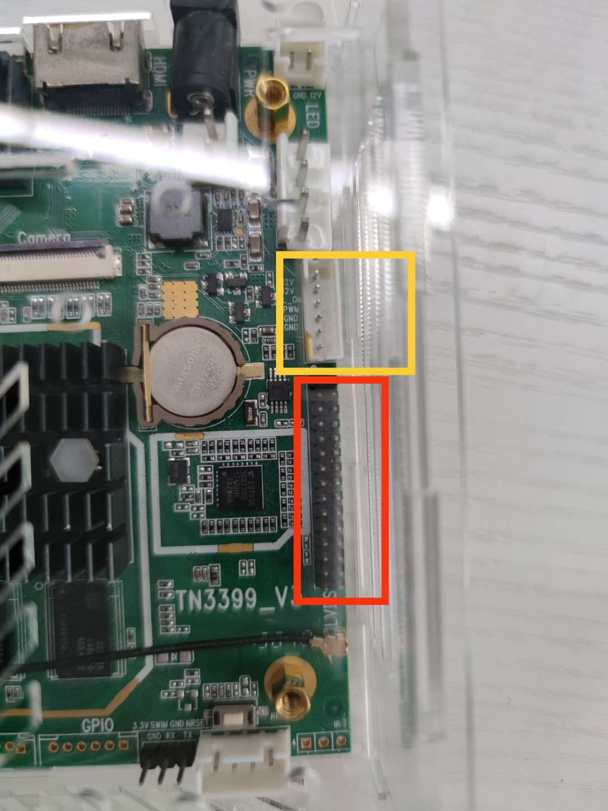

# LVDS屏幕的连接和硬件修改

TC358775可通过配置输出单/双通道的6/8bit LVDS信号，最大分辨率见datasheet

本文使用的屏幕为LVDS to TTL转接板搭配50pin的RGB屏幕，色彩为RGB888

转接板输入端为单通道8bit LVDS信号，物理接口部分为2x10pin的2.0mm间距插针

将其插到TN3399_V3的30pin上半部分，正好只使用了TC358775的第一通道

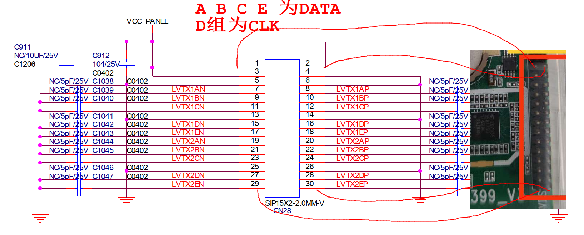

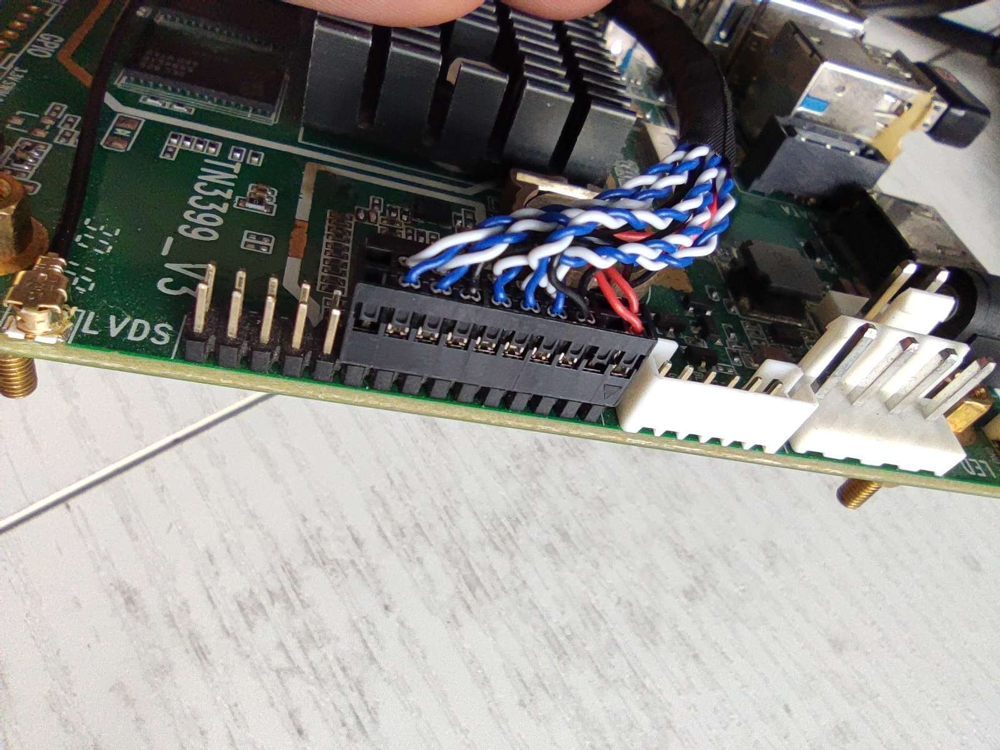

该屏幕的背光不可控，默认打开，所以上面的PWM0用不上

LVDS屏幕的供电电压选择在TN3399_V3的背面设置

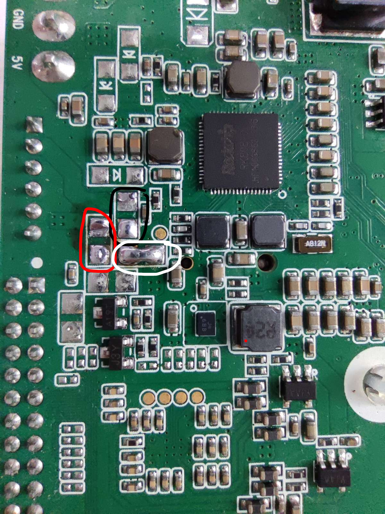

短接黑色部分，屏幕供电为12V

短接红色部分 ，屏幕供电为5V

短接白色部分 ，屏幕供电为3.3V

本文屏幕为3.3V供电，所以短接白色部分，断开其他两路

TC358775的LVDS输出时钟可以选择接外部晶振，或者从输入的DSI时钟分频而来，由于不知道板子上的晶振频率且频率不好改变，推荐使用DSI时钟分频的方案，即断开R944的连接（下图红色部分）

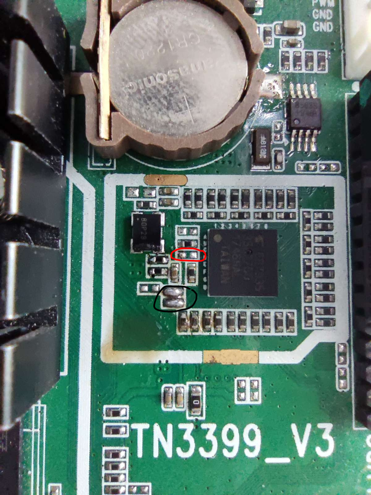

上图中黑色部分接上后，可通过i2c4读取TC358775的寄存器来debug，非必须

# 驱动的使用

本文的驱动适用于供电电压为3.3V、分辨率为1024x600、刷新率为60Hz屏幕，且TC358755使用DSI时钟作为LVDS时钟

已知问题：

~~参数配置导致色彩问题~~

增大TC358775的DSI时钟参数后解决，分析见下文

~~TC358775芯片工作一段时间后会挂掉~~

并不是TC358775挂掉，而是系统息屏后芯片进入了休眠状态，目前没找到重新唤醒的方法，可以设置成永不息屏

理想的解决办法是休眠后，拉高reset pin，再断掉TC358775的供电电源，唤醒时再重新上电配置一次寄存器，可惜TC358775的电源不可控，要断电只能断VCC5V0_SYS，但是太多设备依赖它。reset pin与GPIO1_D0暂时NC，且GPIO1_D0又被用在其他地方

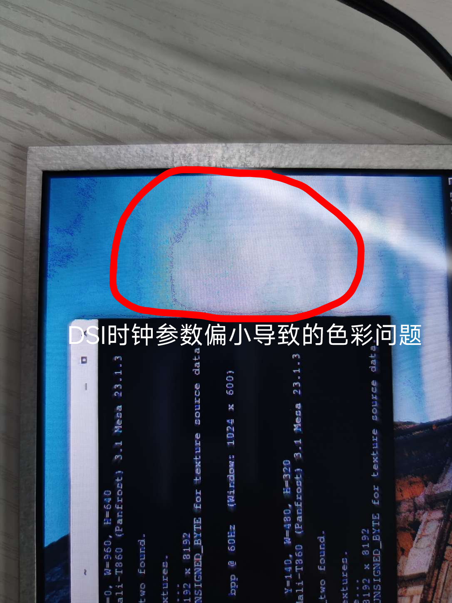

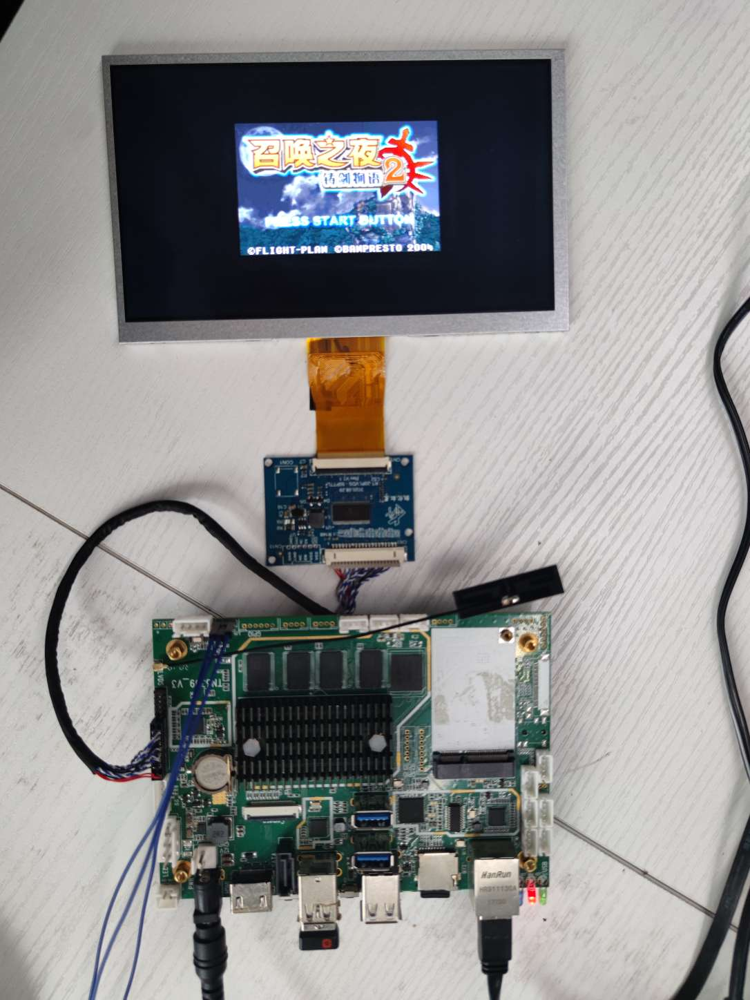

驱动有下面两种使用方式

## 添加进内核

下载内核源码，打上`linux6.4.3-add-tn3399-v3-with-1024x600-panel-support.patch`补丁，编译时选项勾选上

Device Drivers -> Graphics support -> Display Panels -> TOSHIBA TC358775 panel driver

编译即可，内核镜像为Image，设备树为rk3399-tn3399-v3-with-tc358775-panel.dtb，不要忘记`make modules_install`导出内核模块

## 作为树外模块使用

在Armbian系统中没有找到和运行内核匹配的build source（包含内核头文件、和系统相同的Kconfig配置、一些符号文件），使用`apt search rockchip64 source`只能找到旧内核的镜像和build source，所以使用Armbian驱动屏幕，只能自己编译内核或者使用apt回退内核版本

这里以Manjaro-ARM举例

先将Manjaro-ARM系统的设备树替换成仓库中的rk3399-tn3399-v3-with-tc358775-panel.dtb

使用`sudo pacman -Syyu`将所有包更新，如果内核有更新，最好重启

接着安装内核source和编译工具

```
sudo pacman -S linux-headers gcc make
```

将仓库中的lvds-out-of-tree-mod目录上传到Manjaro-ARM中，修改Makefile中的BUILD_DIR为对应的内核source位置，执行

```
make -j6
sudo make install
sudo depmod -a
# 更新initramfs
sudo mkinitcpio -p linux
```

最后重启即可自动加载驱动模块，也可以执行sudo modprobe panel-toshiba-tc358775来加载

如果内核版本有更新，需要重新make内核模块并安装。使用dkms管理该内核模块，内核版本在更新时会自动编译并安装，一劳永逸

# 为其他屏幕适配驱动

首先根据上文修改TN3399_V3的硬件

对好屏幕和TN3399_V3的LVDS插针定义并插上屏幕

以适配1024x600 60Hz的RGB888屏幕为例

## 得到屏幕时序

如果有屏幕厂家提供时序最好，没有的话，参考其他屏幕的时序也可以

下载内核源码，打开drivers/gpu/drm/panel/panel-simple.c，搜索1024，找到合适的屏幕时序，抄下来

PS：这里的clock即pixel clock，等于h_total * v_total * fps = (1024 + 156 + 8 + 156) * (600 + 16 + 6 + 16) * 60 = 51448320 pixel/s，也就是说1s要传输这么多的像素点

代码里的clock单位为k pixel/s，所以要除去1000，再取个整，就是51450。由于取了整，拿51450 * 1000再除以1帧的像素点个数，等于60.xxxx帧，这就是在某些地方看到小数帧的由来

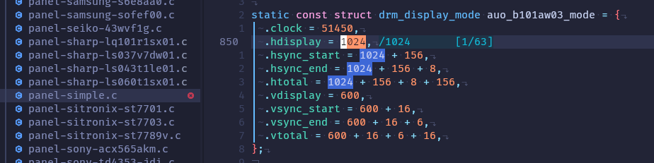

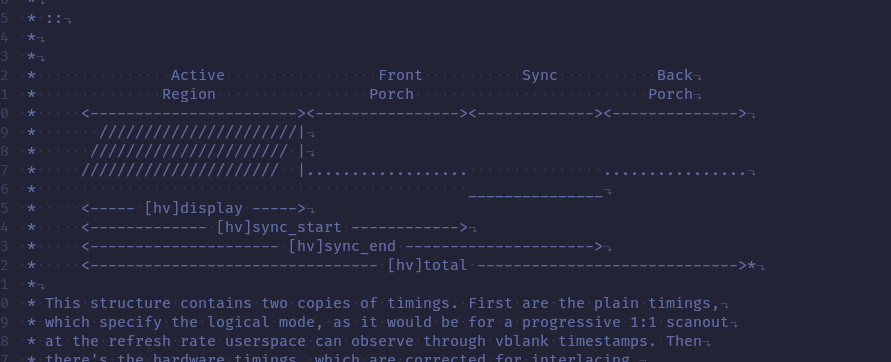

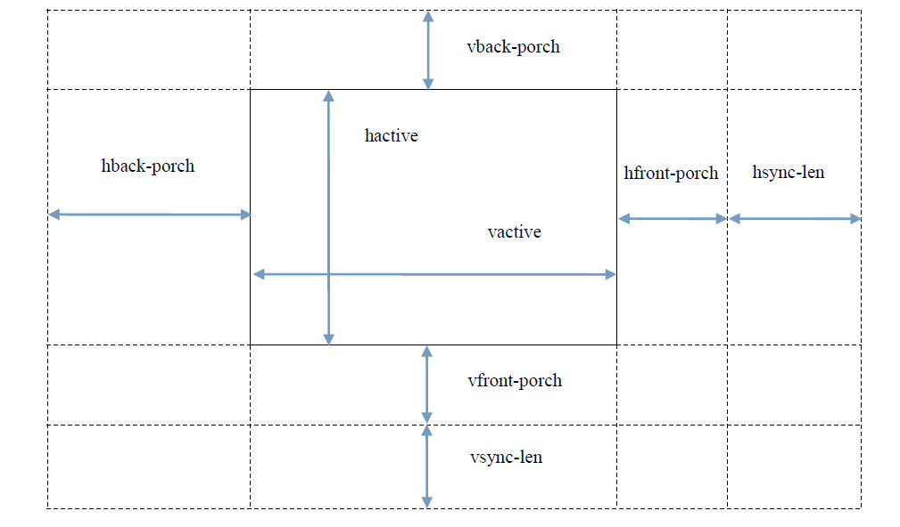

## 根据时序计算TC358775寄存器

打开TC358764_5_774_5XBG_DSI-LVDS_Tv11p_nm_1280x800.xls表格（表格从网上找的，默认是1280x800的参数），在下面切换到Timing Parameters_SYNC_EVENT

在左边填上刚才抄过来的屏幕时序

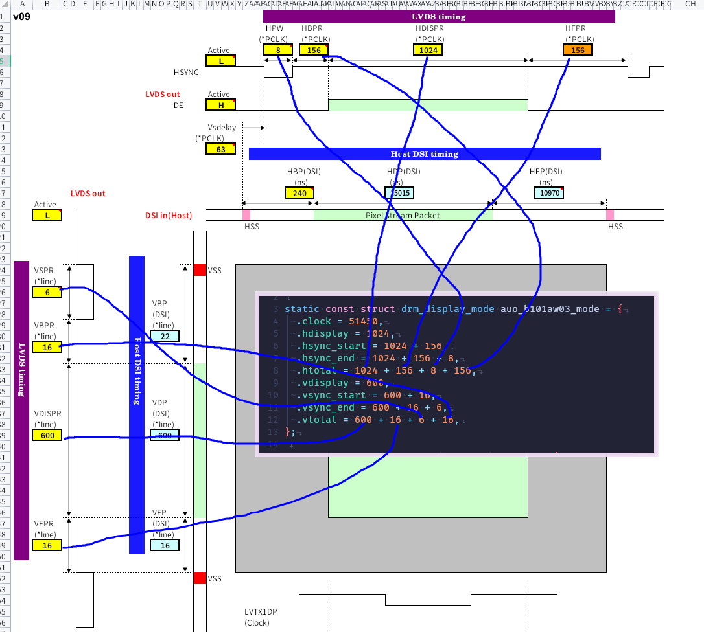

接着设置其他参数，只有黄色的部分需要设置

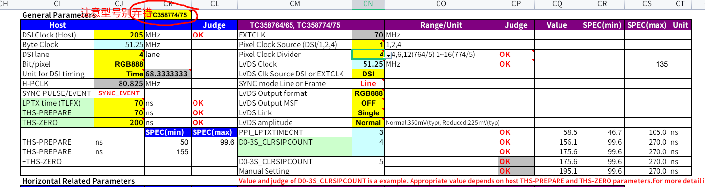

- DSI Clock = h_total * v_total * fps * bpp / dsi_lanes / 2 = pixelclock * bpp / dsi_lanes / 2

1秒传输的像素点个数*每个像素点占的位数/传输用的通道数/2就等于时钟1秒中传输的位，即DSI Clock（又叫DSI bit clock），除以2是因为数据在时钟的上升沿和下降沿都采样（DDR）

对于举例的屏幕，DSI Clock = 51450 * 1000 * (8 + 8 + 8) / 4 / 2 = 51450000 * 3 = 154350000，那么取个整，填155Mhz是否可行呢

填写155MHz可以亮屏，但是屏幕显示很模糊，还会有一堆麻点（见上文图片），这是TC358775的DSI时钟配置慢于RK3399导致的

难道公式不对？不，因为DSI除了要传输视频包，还需要传输其他的数据，所以RK3399实际DSI时钟要比公式高上一些，通过RK3399的DSI驱动可以看出实际/理论=1/0.8

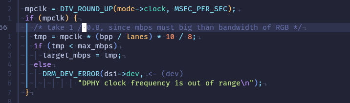

所以这里的值我们需要填大些，但不能瞎填，因为LVDS的时钟由它分频而来，LVDS时钟频率太高会导致帧率过高显示不正常（可以玩屏幕超频？）

我们如果填写155Mhz，再3分频为51.67Mhz给作为LVDS的时钟，那么根据公式LVDS端的输出帧率大概是60Hz

干脆我们填51450000 * 4取个整为205MHz，然后4分频大概还是51Mhz，LVDS输出端大概为60Hz，完美

- Pixel Clock Source为1

- Pixel Clock Diver为4，LVDS Clock = DSI Clock / Pixel Clock Source / Pixel Clock Diver = DSI Clock / 4，即4分频

- LVDS Clk Source DSI or EXTCLK选择DSI

参数填写完毕后，点击下面切换到source，需要配置的寄存器都被计算出来了

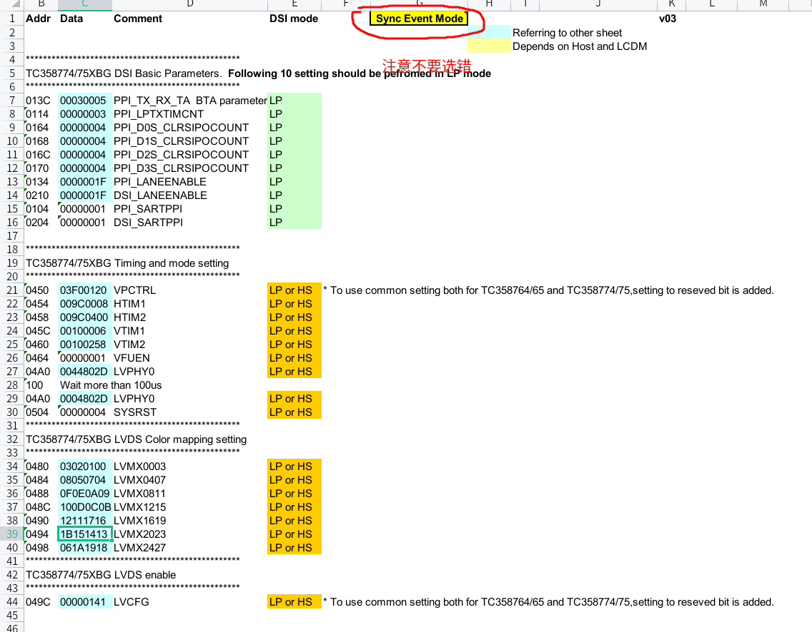

例如013C 00030005，是指0x013C的值应该为0x00030005

写寄存器可以通过i2c或DSI命令，本文的驱动使用DSI命令

## 修改驱动

有了屏幕时序参数和TC358775的寄存器设置，就可以修改本文的驱动了，打开panel-toshiba-tc358775.c

找到static const struct drm_display_mode tc358775_mode，修改时序参数

找到static u8 tc358775_init_seq[27][6]数组，这里面是寄存器的配置，修改成刚才计算出来的即可，字节序是LSB First

例如013C 00030005，先传寄存器地址0x013C->0x3C 0x01，再传寄存器的值0x00030005->0x05 0x00 0x03 0x00，写成数组的格式为{ 0x3C, 0x01, 0x05, 0x00, 0x03, 0x00 },

修改完毕后，按照上文的教程，要么编译整个内核，要么以树外模块使用，不出意外屏幕就可以点亮

# 调试过程中可能遇到的问题

- 修改驱动文件并make && sudo make install（Debian系列是update-initramfs命令）后，重新开机修改未生效

执行`sudo mkinitcpio -p linux`将新的驱动模块更新到initramfs中，每次开机使用的都是initramfs中的驱动模块，不会使用rootfs中的

- 显示内容超出实际屏幕或者屏幕有黑边

时序和屏幕不合，毕竟是抄来的时序。调整hfront_proch、hback_proch、vfront_proch、vback_proch，那边有异常就调整哪个，注意其他参数例如时钟也要重新计算
